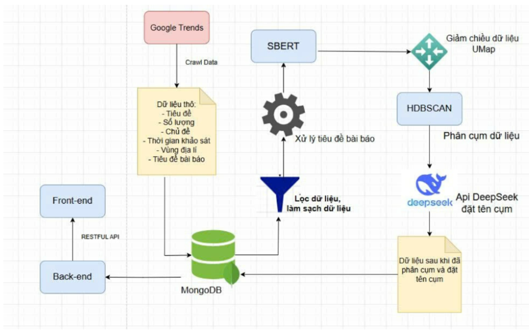
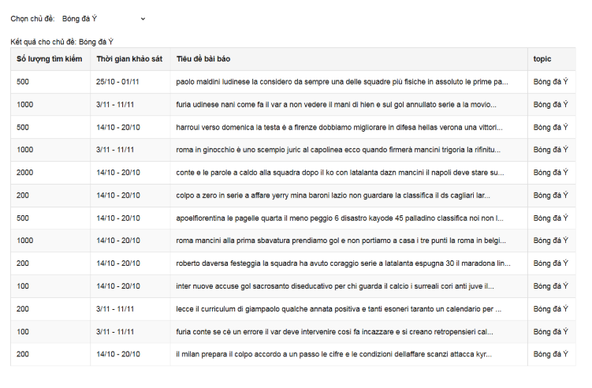
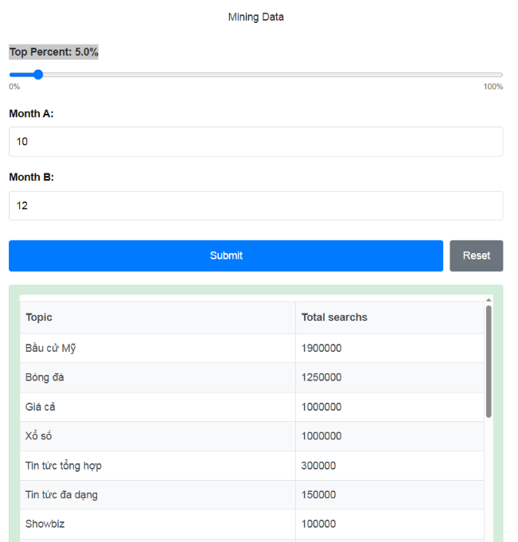

# 📰 News Headlines Clustering System using HDBSCAN

## 📌 Project Overview

This project aims to build a clustering system for Vietnamese news headlines using **HDBSCAN**, with the goal of automatically identifying and naming topic groups from Google Trends data. It leverages modern NLP techniques, unsupervised learning, and large language models (LLMs) for topic discovery and visualization.

---

## 🧩 System Architecture



The system is composed of the following components:

1. **Data Collection**:
   - Data is crawled from **Google Trends**, including:
     - Search query (title)
     - Search volume
     - Topic
     - Time range
     - Geographic region
     - Related news headlines

2. **Preprocessing & Vectorization**:
   - Raw data is cleaned and stored in **MongoDB**.
   - News headlines are encoded into sentence vectors using **SBERT (Sentence-BERT)**.
   - Vectors are reduced to 2D using **UMAP** for better clustering and visualization.

3. **Clustering**:
   - **HDBSCAN** is used for clustering because:
     - It does not require the number of clusters to be predefined.
     - It can detect outliers (noise).
     - It supports clusters of arbitrary shapes and varying densities.

4. **Topic Naming via LLM**:
   - After clustering, each cluster is passed to the **DeepSeek API** to generate concise and meaningful topic names.

5. **Storage & Presentation**:
   - Clustered and labeled data is saved back to **MongoDB**.
   - A **Flask backend** exposes RESTful APIs to the **frontend** for displaying statistics:
     - List of news headlines per topic
     - Search volume distribution per topic over time

> 🔁 Data Flow: Google Trends → Preprocessing & SBERT → UMAP → HDBSCAN → DeepSeek API → MongoDB → Backend → Frontend

---

## 🧪 Technologies Used

- **Language**: Python 3
- **Frameworks**: Flask, UMAP, HDBSCAN
- **Libraries**: `sentence-transformers`, `pandas`, `scikit-learn`, `pymongo`, `apscheduler`
- **Database**: MongoDB Atlas
- **Frontend**: (Custom interface using RESTful APIs)
- **External API**: DeepSeek (for topic naming via LLM)

---

## 🧠 Model Pipeline

1. Load raw data (CSV) into MongoDB.
2. Clean and preprocess titles.
3. Encode titles using SBERT.
4. Normalize and reduce dimensionality with UMAP.
5. Cluster using HDBSCAN.
6. Name clusters with DeepSeek.
7. Serve results via REST API.

---

## 📊 Available APIs

| Endpoint              | Method | Description                                     |
|-----------------------|--------|-------------------------------------------------|
| `/topPaperPerTopic`   | POST   | Returns topics with highest search volume       |
| `/detailPaperPerTopic`| POST   | Returns news headlines by selected topic        |
| `/topic`              | GET    | Retrieves list of all unique topics             |

---

## ✅ Strengths

- Captures semantic similarity via SBERT embeddings.
- Automatic and meaningful topic labeling with LLM.
- Handles noise and irregular cluster shapes using HDBSCAN.
- Supports interactive exploration via a frontend UI.

## ⚠️ Limitations

- DeepSeek API dependency (rate limits, availability).
- SBERT may need fine-tuning for domain-specific Vietnamese data.
- Computational cost for large datasets.

---

## 🚀 Deployment Instructions

1. **Install dependencies**:
    ```bash
    pip install -r requirements.txt
    ```

2. **Start Daily Task** in order to update data every 1 am:
    ```bash
    python daily_task.py
    ```

3. **Start Backend** in new terminal:
    ```bash
    python app.py
    ```

4. **Start Frontend** in new terminal:
    ```bash
    cd front-end
    npm run dev
    ```
## 🖼️ Sample Results

Below are example outputs from the system:

### 🔹 List of news headlines for a specific topic



### 🔹 Statistics of search volume by topic



---
